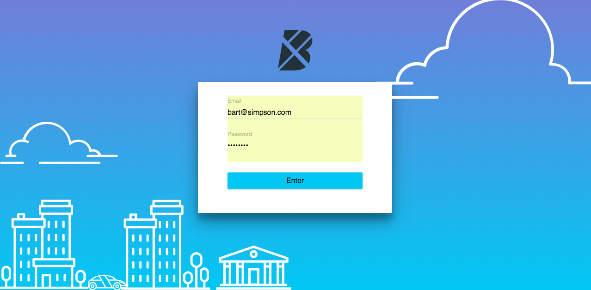
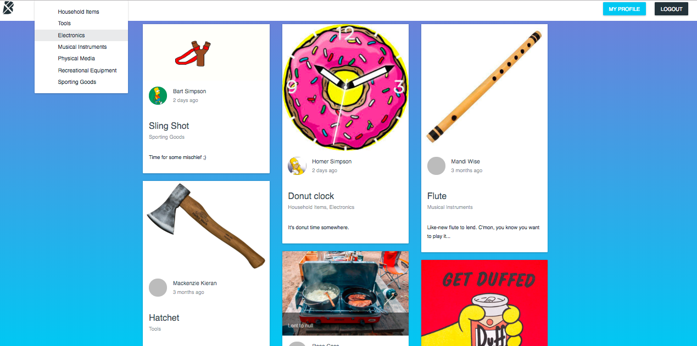

# Boomtown

An application to share your goods and items with the community. Built with React, Express, GraphQL and Redux.

login: bart@simpsons.com password: password





## Installation

Download the repo, then run:

```bash
cd client && npm install
```

## Start-up

From inside the `client` directory, run:

```bash
npm start
```

From inside the `server` directory, run:

```bash
npm start
```

## Technology Used
* React - react router
* JavaScript
* Express
* PostgreSQL
* Firebase
* GraphQL - Apollo
* Redux
* Git - Github

## Features
* React for client side. With 2 sets of Components: Components - presentational & Containers - functional.
* Server side uses Firebase to hold User info and Authentication. And PostgresSQL for the Item database.
* GraphQL for User and Item Queries and Mutations.
* Redux is filtering the tags on items and for user authentication.

## Authors
* **Aaron Griffiths** - (aa.griff9@gmail.com)


## Acknowledgement
* Thanks to the Red instructor team for providing the materials and skills to make this site happen.
* Thanks to my cohort for their support.

